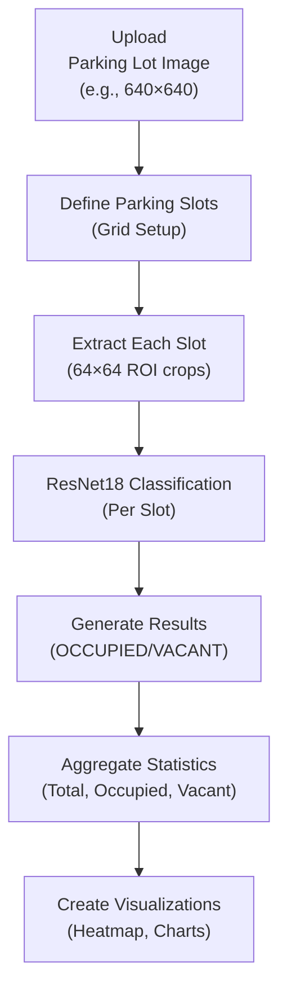

# 🅿️ Multi-Slot Parking Lot Analyzer - Complete Guide

## ✨ What Changed?

Your web app now analyzes **entire parking lots** instead of single spaces!

### Old App Behavior ❌
```
Upload Image → Resize to 64×64 → Single classification → Result: "OCCUPIED" or "VACANT"
```
**Problem**: Works only for single parking space images

### New App Behavior ✅
```
Upload Image → Define/Detect Parking Slots → Analyze Each Slot → 
Statistics: "Total: 120, Occupied: 87, Vacant: 33, Rate: 72.5%" + Heatmap
```
**Solution**: Full lot analysis with per-space classification!

---

## 📊 Key Features

| Feature | Description |
|---------|-------------|
| 🔍 **Auto-Grid Detection** | Automatically divide parking lot into grid of spaces |
| ✏️ **Manual Slot Definition** | Manually set slot positions, sizes, and layout |
| 📤 **Config Upload** | Reuse previously saved slot definitions (JSON) |
| 📈 **Aggregate Statistics** | Total spaces, occupied count, vacant count, occupancy % |
| 🎨 **Color Heatmap** | Visual overlay: Red=Occupied, Green=Vacant |
| 📊 **Pie Charts** | Occupancy ratio visualization |
| 📋 **Detailed Table** | Per-slot confidence scores |
| ⚡ **GPU/CPU Support** | Select processing device |
| 🎛️ **Confidence Threshold** | Adjust detection sensitivity |

---

## 🚀 Quick Start

### 1. Start the App
```bash
streamlit run app.py
```

### 2. Load Model
- Click **"🔄 Load Model"** in sidebar
- Select device (CPU or GPU)
- Wait for ✅ confirmation

### 3. Upload Parking Lot Image
- Click upload area
- Select full parking lot photo (aerial/overhead best)

### 4. Define Slots
Choose one of three methods:

#### **Option A: Auto-Grid (RECOMMENDED)** ⭐
Best for regular parking lots with visible grid pattern
```
Rows:    5
Columns: 8  
→ Generates 40 parking spaces automatically
```

#### **Option B: Manual Grid Setup**
Best for irregular layouts or precise control
```
Start X: 0
Start Y: 0
Slot Width: 100 pixels
Slot Height: 100 pixels
Rows: 5
Columns: 8
```

#### **Option C: Upload Slot Config**
Best for reusing previously saved layouts
```
Upload → slots_config.json
Click "Load Config" → Loads pre-defined slots
```

### 5. Click "🎯 Analyze All Slots"
- Model processes each parking space
- Results appear automatically

### 6. View Results
- 📊 **Statistics**: Total, Occupied, Vacant, %
- 🎨 **Heatmap**: Color-coded parking lot visualization
- 📈 **Pie Chart**: Occupancy ratio
- 📋 **Details**: Per-slot confidence scores

---

## 🔄 How It Works

### Processing Pipeline



### For Each Parking Slot:
1. **Extract** slot region (ROI - Region of Interest)
2. **Resize** to 64×64 pixels (model standard)
3. **Classify** using trained ResNet18
4. **Output** result (OCCUPIED or VACANT) + confidence %

### Final Results:
- ✅ Per-slot classification
- ✅ Color visualization
- ✅ Occupancy statistics
- ✅ Confidence scores

---

## 📸 Example Workflow

### Before (Single Space)
```
Upload: parking_space.jpg (64×64)
Result: "OCCUPIED - 98% confidence"
Problem: Only works for one space at a time
```

### After (Full Lot)
```
Upload: parking_lot_aerial.jpg (640×640)
Setup: Auto-Grid with 5 rows × 8 columns (40 spaces total)
Result:
  - Total Spaces: 40
  - Occupied: 28
  - Vacant: 12
  - Occupancy Rate: 70%
  - Visual heatmap with color overlay
  - Per-space confidence scores
```

---

## 🎯 Configuration Options

### Device Selection
| Device | Speed | Best For |
|--------|-------|----------|
| **CPU** | ~2-5 sec/slot | Laptops, compatibility |
| **GPU (CUDA)** | ~0.1 sec/slot | Desktop with NVIDIA GPU |

### Confidence Threshold
| Threshold | Behavior |
|-----------|----------|
| **0.0-0.3** | Very sensitive (may have false positives) |
| **0.5** | Balanced (recommended) |
| **0.7-1.0** | Strict (fewer false positives) |

---

## 📊 Understanding Results

### Statistics Meanings

```
Total Spaces: 120
├─ Occupied: 87 (72.5%)
└─ Vacant: 33 (27.5%)

Occupancy Rate: 72.5%
└─ Interpretation: Parking lot is 72.5% full
```

### Color Coding
- 🔴 **Red** = Space is OCCUPIED (vehicle detected)
- 🟢 **Green** = Space is VACANT (empty)
- **Brightness** = Model confidence in prediction

---

## 🎨 Visual Outputs

### 1. Heatmap Overlay
Colored rectangles on original image:
- Red boxes highlight occupied spaces
- Green boxes highlight vacant spaces
- Clear visual identification of every space

### 2. Pie Chart
Occupancy breakdown:
- 🔴 Red slice = Occupied %
- 🟢 Green slice = Vacant %
- Shows at a glance how full the lot is

### 3. Detailed Table
Shows each space with:
- Space ID/Label
- Status (OCCUPIED/VACANT)
- Confidence % (0-100%)
- Visual progress bar

---

## 💡 Tips for Best Results

### Image Quality
✓ **Aerial/Overhead View** - Drones, high roof cameras  
✓ **Daytime Lighting** - Bright, clear conditions  
✓ **High Resolution** - 640×480 minimum, 1280×960 recommended  
✓ **Clear Lines** - Parking space boundaries clearly visible  

### Slot Configuration
✓ **Match Actual Layout** - Grid should match parking lot organization  
✓ **No Overlaps** - Ensure slots don't overlap each other  
✓ **Proper Spacing** - Set width/height to actual space size  
✓ **Full Coverage** - Include all visible parking spaces  

### Settings
✓ **Confidence Threshold** - Start at 0.5, adjust if needed  
✓ **Device Selection** - Use GPU if available for speed  
✓ **Appropriate Grid Size** - Balance accuracy vs speed  

---

## 📋 Configuration Format

If you want to save and reuse slot configurations, use this JSON format:

```json
{
  "slots": [
    {
      "id": 0,
      "label": "A1",
      "x": 0,
      "y": 0,
      "w": 100,
      "h": 100
    },
    {
      "id": 1,
      "label": "A2",
      "x": 100,
      "y": 0,
      "w": 100,
      "h": 100
    },
    {
      "id": 2,
      "label": "B1",
      "x": 0,
      "y": 100,
      "w": 100,
      "h": 100
    }
  ]
}
```

### Fields:
- `id` - Unique slot number (0, 1, 2, ...)
- `label` - Display name (A1, A2, B1, etc.)
- `x` - Left-edge pixel position
- `y` - Top-edge pixel position
- `w` - Width in pixels
- `h` - Height in pixels

---

## 🔧 Troubleshooting

### "Analysis takes too long"
**Problem**: Slow inference speed  
**Solution**:
- Switch to GPU device (10-50x faster)
- Reduce grid size (fewer slots to analyze)
- Use smaller input images

### "Results are inaccurate"
**Problem**: Wrong OCCUPIED/VACANT classifications  
**Solution**:
- Check parking space clarity in image
- Adjust confidence threshold slider
- Try different grid configuration
- Ensure good lighting

### "Memory error"
**Problem**: Not enough RAM for analysis  
**Solution**:
- Use GPU if available (offloads memory)
- Reduce slot count
- Close other applications

### "Model won't load"
**Problem**: Model file missing or corrupted  
**Solution**:
```bash
# Verify model exists
ls module4_deep_learning/resnet18_parking.pth

# Check PyTorch
python -c "import torch; print(torch.__version__)"

# Reinstall if needed
pip install torch
```

---

## 📦 Project Structure

```
ParkingSpaceDetectionMP/
├── app.py                          # Multi-slot Streamlit app ✨ NEW
├── MULTI_SLOT_GUIDE.md            # This guide ✨ NEW
├── WEB_APP_README.md              # Original web app docs
├── QUICKSTART.md                  # Quick setup guide
│
├── module4_deep_learning/
│   ├── inference_engine.py        # ResNetClassifier
│   ├── resnet18_parking.pth       # Trained model weights (43MB)
│   └── README.md
│
├── module2_preprocessing/
│   ├── preprocessor.py
│   └── README.md
│
├── requirements.txt               # Python dependencies
└── code/
    ├── train.py                   # Training script
    └── X_train.npy / y_train.npy  # Training data
```

---

## 🎓 Example Analysis Scenarios

### Scenario 1: Small Parking Lot
```
Image: Small shopping center lot (320×240 pixels)
Grid: 4 rows × 6 columns = 24 spaces
Result: 18 occupied, 6 vacant (75% full)
Time: ~5 seconds on CPU, ~1 second on GPU
```

### Scenario 2: Large Parking Deck
```
Image: Multi-level lot (1280×960 pixels)
Grid: 10 rows × 15 columns = 150 spaces
Result: 112 occupied, 38 vacant (75% full)
Time: ~30 seconds on CPU, ~10 seconds on GPU
```

### Scenario 3: Street Parking
```
Image: Street view (900×600 pixels)
Manual: Custom grid with irregular spacing
Result: 20 occupied, 3 vacant (87% full)
Time: ~10 seconds on CPU, ~2 seconds on GPU
```

---

## 🚀 Next Steps

### Try It Now
```bash
streamlit run app.py
```

### Features Coming Soon
- 📹 Real-time camera feed support
- 📊 Historical trend analysis
- 🎯 Smart slot auto-detection (no grid needed)
- 📱 Mobile app version
- 🗺️ Multi-lot management

---

## ❓ FAQ

**Q: Why does accuracy vary between images?**  
A: Model trained on specific lighting/angle conditions. Try similar settings for best results.

**Q: How do I know if my grid is correct?**  
A: Visual overlay will show if rectangles match parking spaces. Adjust if needed.

**Q: Can I analyze multiple parking lots with one config?**  
A: Yes! Export grid as JSON, use same config for similar lots.

**Q: GPU vs CPU - which should I choose?**  
A: GPU is 10-50x faster but requires NVIDIA CUDA. CPU works on any computer.

**Q: What image resolution do I need?**  
A: Minimum 640×480. Higher = more accurate. 1280×960+ recommended.

---

**For questions or issues, check the web app's ℹ️ "How It Works" section!**
